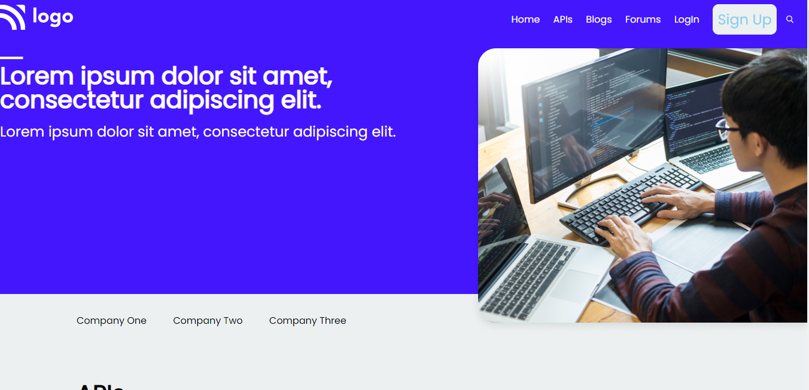

# Crush Your Competition

# [Link of deploy live project](https://computerboy.netlify.app/)

# What I learned from this project-04

- It is helpful to understand the cconcept the position.
- It is helpful to understand flex.
- It is helpful to give understanding about the navigation bar.
- It is good project to clear your about project related.

# Howmany time consumed to make this project.

- It took at least 8 hours . it is some difficult compare to last project